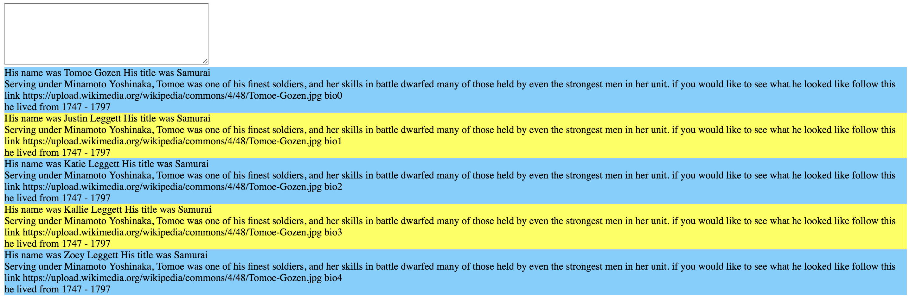
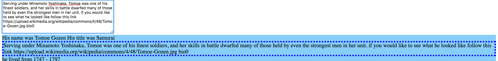
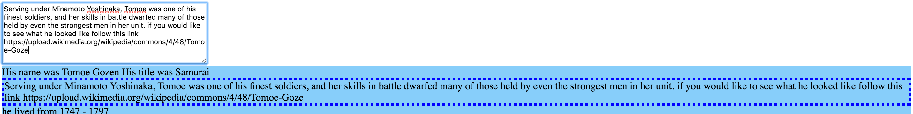

#What You See is What You Get(WYSIWYG)


## Description
In this project we use eventListeners as well as some javascript manipulation. When the user clicks on a given element the innerHTML is added to the input field and any change the user makes to the data in reflected in real time back to the section it came from.

## How to run
In your terminal run:
```
http-server -p 9999
```
then navigate to http://localhost:9999 in your browser.

## Screenshots
##On Page Load

##On Section CLick

##Editting Text


## Contributors
- [Justin Leggett](https://github.com/justinal64)